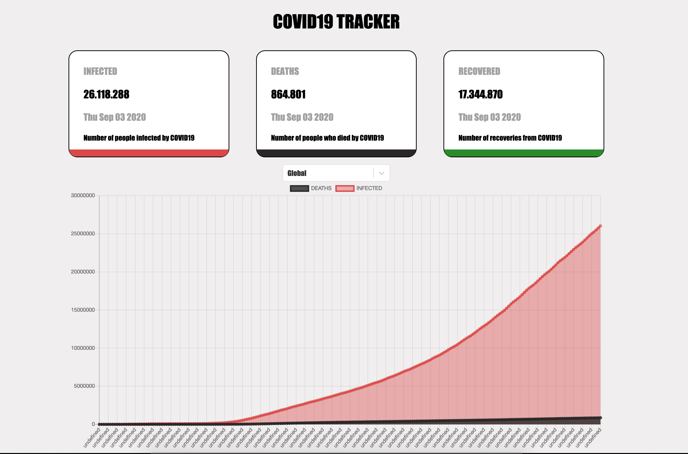
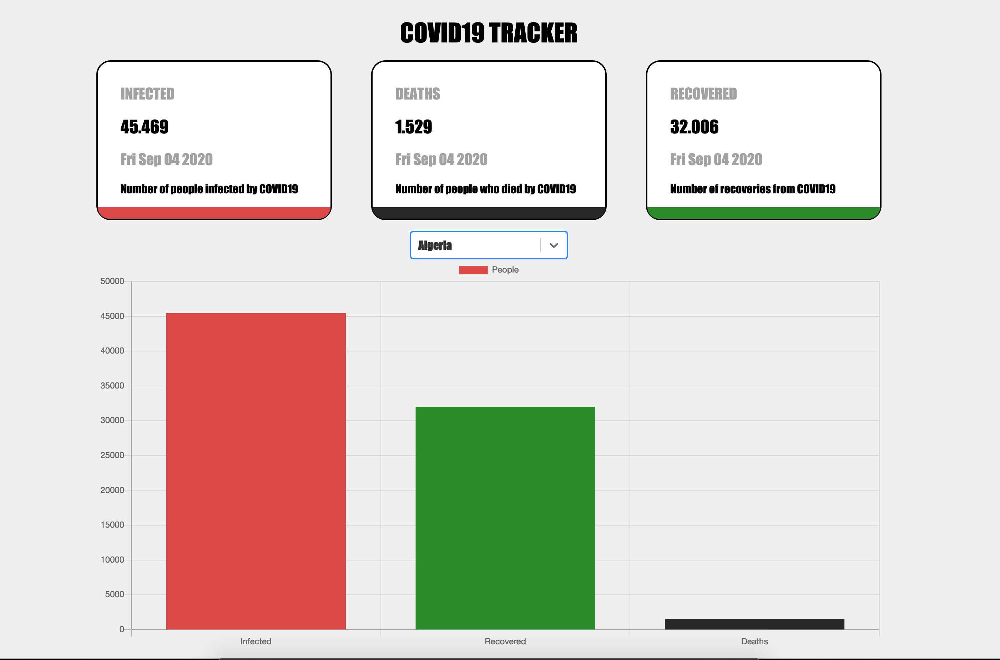

<h1 align="center"> COVID TRACKER </h1>

## Covid19 tracker web application built in react and typescript using the state management redux and an external api.

### Languages and Tools:

### Website:

[Website](https://covid-tracker-hazel.vercel.app/)